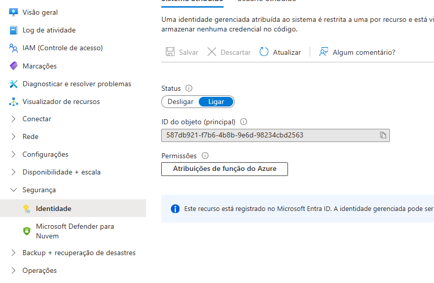
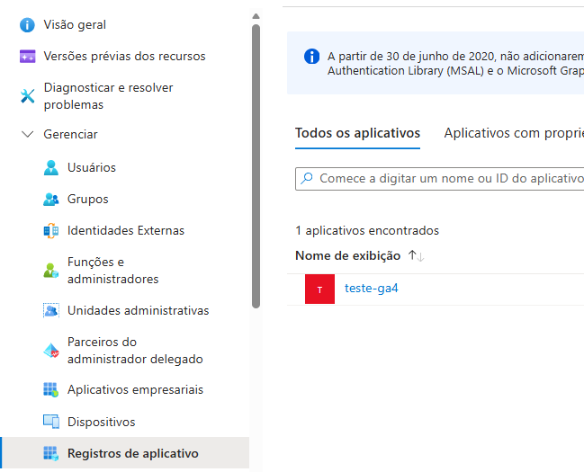
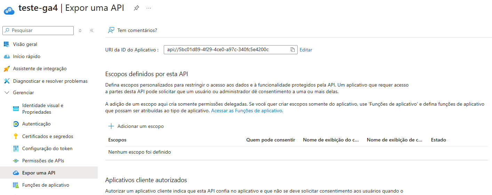
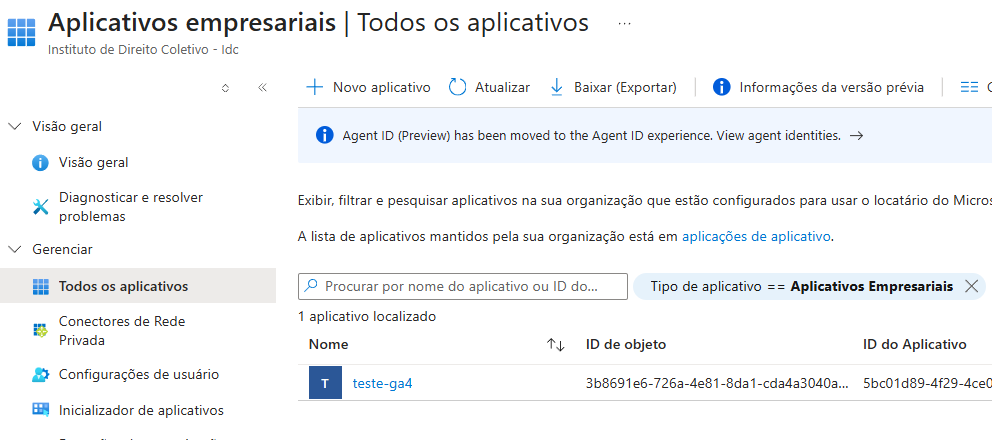
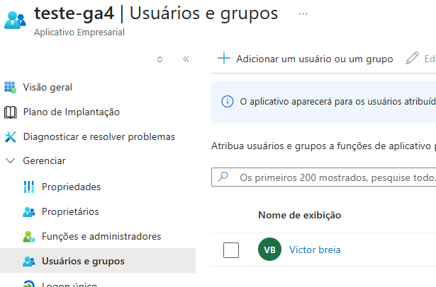
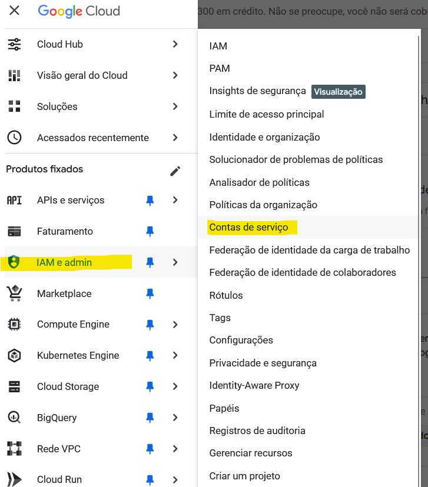
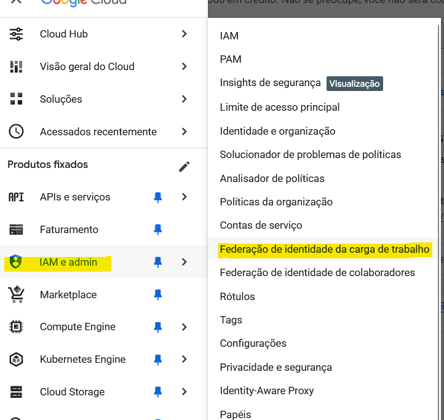
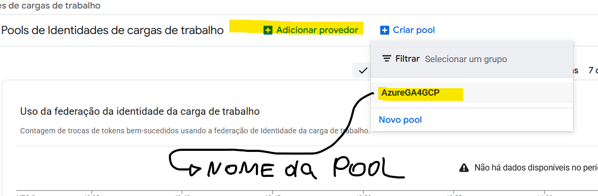

# Integração GA4 + Azure VM via Workload Identity Federation (GCP)

Este documento descreve, passo a passo, como configuramos uma **VM na Azure** para acessar a **API do Google Analytics 4 (GA4)** usando **Workload Identity Federation (WIF)** no Google Cloud, **sem usar chave JSON tradicional**.

A ideia é que qualquer pessoa da equipe consiga:

- Entender a arquitetura
- Reproduzir a configuração
- Manter / evoluir os scripts de coleta (GA4 → pipeline)

---

## Passo 1: Configurar AzureVM com Identidade Gerenciada

Para que a VM na Azure consiga autenticar via WIF no Google Cloud, é necessário configurar a identidade gerenciada da VM para que ela tenha permissão de acesso ao app registration que criamos no Google Cloud.

1. A **VM na Azure** possui uma **Identidade Gerenciada (Managed Identity)**. Como mostrado abaixo:
   
   - Depois disso, vamos onfirmar que o App Registration existe na Azure:
   - No portal, abra:
       - Microsoft Entra ID (Azure Active Directory)
       - No menu lateral, clique em:
           - Registros de aplicativos
           - Busque pelo nome da VM (ou o nome que você deu para a identidade gerenciada) e clique nele.
           - 
2. Tornar o App Registration visível como Aplicativo Corporativo
   - Isso é obrigatório senão você não consegue atribuir usuários/grupos/identidades.
       - Dentro do gcp-wif-app, clique no menu lateral: **Expor uma API**
       - Insira algo como: **api://<ID_DO_CLIENTE>** e clique em salvar.
       - 
       - Agora o app aparece automaticamente como Aplicativo Corporativo (Enterprise Application).

3. Acessar o Aplicativo Corporativo
   - No menu lateral do Microsoft Entra ID, clique em: **Aplicativos Empresariais** e busque pelo nome da VM (ou o nome que você deu para a identidade gerenciada).
   - Você está agora na tela correspondente ao “Enterprise Application” do app.
   - 

4. Atribuir acesso da VM ao app
   - No menu lateral dentro do app, clique em: **Usuários e grupos**
   - Clique no botão superior: Adicionar usuário/grupo
   - 
   - No painel lateral que abrir, clique no campo: **Nenhum selecionado (ou “Selecionar usuários/grupos”)**
   - Agora busque pelo nome da sua VM
     - Clique nela
     - Clique no botão Selecionar
     - Finalmente, clique no botão Atribuir.
  
### No caso do seguinte erro abaoixo ocorrer ao rodar o curl

```bash
{"error":"invalid_request","error_description":"Required query variable 'resource' is missing"}azureuser@teste-ga4:~$
```

Se você receber esse erro, significa que a identidade gerenciada não está corretamente atribuída à VM. Será preciso rodar a chamada correta para registrar a identidade. Execute exatamente isto no terminal da VM:

```bash
curl -H Metadata:true \
  "http://169.254.169.254/metadata/identity/oauth2/token?api-version=2018-02-01&resource=api://AzureADTokenExchange"
```

Isso força a VM a pedir um token real. A resposta deve ser parecida com:

```json
{
  "access_token": "eyJ0eXAiOiJKV1QiLCJh...",
  "client_id": "xxxx...",
  "expires_in": "3599",
  "resource": "api://AzureADTokenExchange",
  "token_type": "Bearer"
}
```

## Passo 2: Criar o Workload Identity Pool no Google Cloud

Agora que a VM na Azure está configurada com uma Identidade Gerenciada, vamos configurar o Workload Identity Federation no Google Cloud para permitir que essa identidade acesse a API do GA4.

- Criar Service Account no GCP
No Console GCP:
Navegar em: IAM e administrador → Contas de serviço → Criar conta de serviço


- Nome: azure-workload-sa
- ID: azure-workload-sa
- Projeto: impressive-hall-479920-u3
- Papel mínimo:
- roles/analytics.viewer ou roles/analytics.admin (para testes, usamos admin)

### GCP – Workload Identity Federation (Pool + Provider)

#### Criar Workload Identity Pool

No Console GCP:
Navegar em: IAM e administrador → Workload Identity Federation → Criar Pool


#### Criar o Provider OIDC para Azure

No Console GCP, dentro do Pool azure-pool:
Aba Provedores → Adicionar Provedor


Configurações do Provedor:

- Tipo: OIDC
- Nome exibido: Azure VM Provider
- ID do provedor: azure-provider
- Emissor (issuer): `https://login.microsoftonline.com/a2d1c793-b9ee-4c6f-8ef8-eaf302ff050b/v2.0`
- Audiences: `api://AzureADTokenExchange`
- Mapeamento de atributos:
  - `google.subject` → `assertion.sub`

### GCP – Vincular Provider à Service Account e gerar credencial WIF

- GCP – Vincular Provider à Service Account e gerar credencial WIF No Console GCP:
  - Ainda na página do Pool azure-pool Clique em Conceder acesso, selecione Conceder acesso usando identidades federadas (recomendado)
  - Escolha a Service Account: `azure-workload-sa@impressive-hall-479920-u3.iam.gserviceaccount.com`
  - Selecione o Provider: `azure-provider`
  - Configure o subject de acordo com o fluxo (no nosso caso, usamos o modo simplificado padrão da Google + `--azure`, sem definir subject manualmente)
  - Salve.

### Gerar o arquivo de credenciais WIF (external_account)
No Cloud Shell do GCP:

```bash
export PROJECT_ID="impressive-hall-479920-u3"
export PROJECT_NUMBER="573811419632"
export SA_EMAIL="azure-workload-sa@impressive-hall-479920-u3.iam.gserviceaccount.com"
export POOL_ID="azure-pool"
export PROVIDER_ID="azure-provider"
export APP_ID_URI="api://AzureADTokenExchange"

gcloud iam workload-identity-pools create-cred-config \
  projects/$PROJECT_NUMBER/locations/global/workloadIdentityPools/$POOL_ID/providers/$PROVIDER_ID \
  --service-account=$SA_EMAIL \
  --azure \
  --app-id-uri=$APP_ID_URI \
  --output-file="<sua_chave.json>"
```

Isso gera um arquivo `<sua_chave.json>` do tipo:

```json
{
  "type": "external_account",
  "audience": "//iam.googleapis.com/projects/573811419632/locations/global/workloadIdentityPools/azure-pool/providers/azure-provider",
  "subject_token_type": "urn:ietf:params:oauth:token-type:jwt",
  "token_url": "https://sts.googleapis.com/v1/token",
  "service_account_impersonation_url": "https://iamcredentials.googleapis.com/v1/projects/-/serviceAccounts/azure-workload-sa@impressive-hall-479920-u3.iam.gserviceaccount.com:generateAccessToken",
  "credential_source": {
    "environment_id": "azure.com",
    ...
  }
}
```

## GA4 – Permissões na Propriedade

Na interface do Google Analytics 4 (GA4):

1. Acesse a propriedade desejada
2. Vá em Admin (rodapé)
3. Na coluna Property (Propriedade):
   - Clique em Property Settings / Configurações da propriedade
Anote o Property ID → ex: 414902979
4. Ainda na coluna da Propriedade:
   - Clique em Property Access Management / Gerenciamento de acesso à propriedade
   - Clique em + → Add users / Adicionar usuários
   - No campo de e-mail, adicione:

```text
azure-workload-sa@impressive-hall-479920-u3.iam.gserviceaccount.com
```

Permissão: Viewer / Leitor (suficiente para relatórios)

Se o usuário não enxergar “Gerenciamento de acesso à propriedade”, é porque não tem permissão de administrador da PROPRIEDADE (apenas da Conta). Nesse caso, é preciso que alguém com permissão maior faça essa inclusão.

## Azure VM – Copiar credencial WIF e configurar ambiente

### Copiar <sua_chave.json> para a VM

1. Baixar <sua_chave.json> do Cloud Shell para seu computador local.
2. Do seu computador, enviar para a VM via scp:

```bash
scp -i teste-ga4_key_1201.pem <sua_chave.json> azureuser@40.76.104.89:/home/azureuser/
```

### Mover para diretório padrão e ajustar permissões

Na VM (via SSH):

```bash
sudo mkdir -p /etc/google
sudo mv /home/azureuser/<sua_chave.json> /etc/google/<sua_chave.json>
sudo chmod 644 /etc/google/<sua_chave.json>
```

### Definir variáveis de ambiente

Na VM(via SSH):

```bash
echo 'export GOOGLE_APPLICATION_CREDENTIALS="/etc/google/<sua_chave.json>"' >> ~/.bashrc
echo 'export GA4_PROPERTY_ID="414902979"' >> ~/.bashrc
source ~/.bashrc
```

## Azure VM – Preparar Python e testar GA4

### Instalar Python, venv e dependências
Na VM (via SSH):

```bash
sudo apt update
sudo apt install -y python3 python3-venv python3-pip

python3 -m venv venv
source venv/bin/activate

pip install google-auth google-analytics-data
```

### Testar acesso à API do GA4

Criar test_wif.py Na VM (via SSH):

```python
#!/usr/bin/env python3
import os
import google.auth
from google.analytics.data_v1beta import BetaAnalyticsDataClient
from google.analytics.data_v1beta.types import RunReportRequest, Dimension, Metric, DateRange

def main():
    property_id = os.getenv("GA4_PROPERTY_ID")
    if not property_id:
        raise RuntimeError("A variável de ambiente GA4_PROPERTY_ID não está definida")

    # Ver quem somos no GCP
    creds, project_id = google.auth.default()
    sa_email = getattr(creds, "service_account_email", None)
    print("Autenticado como:", sa_email)
    print("Projeto GCP detectado:", project_id)

    client = BetaAnalyticsDataClient()

    request = RunReportRequest(
        property=f"properties/{property_id}",
        dimensions=[Dimension(name="date")],
        metrics=[Metric(name="activeUsers")],
        date_ranges=[DateRange(start_date="7daysAgo", end_date="today")],
        limit=10,
    )

    response = client.run_report(request)
    print(response)

if __name__ == "__main__":
    main()
```

Rodar:

```bash
source venv/bin/activate
python3 test_wif.py
```

Se tudo estiver configurado corretamente, você verá:

- Autenticado como: azure-workload-sa@...
- Um relatório com dimension_headers, metric_headers, rows de activeUsers por data.